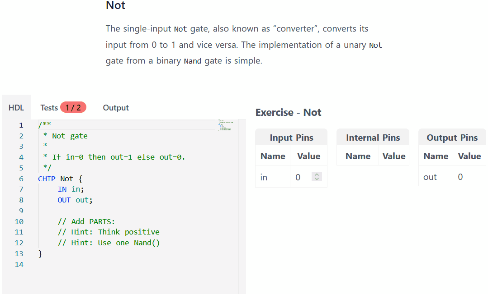

<p align="center">
  <a href="https://chipsandcode.com/">
    
  </a>
</p>

<h3 align="center">Chips and Code</h3>

<p align="center">
  Wondering how computers work? Find out by embarking on the journey of building your own computer from scratch, from chips to code. No prerequisites and for free from the browser.
  <br>
  <a href="https://chipsandcode.com/"><strong>Visit »</strong></a>
</p>

<p align="center">
  <a href="https://snyk.io/test/github/durasj/chipsandcode"></a>
  <a href="https://codeclimate.com/github/durasj/chipsandcode"></a>
  <a href="https://codecov.io/gh/durasj/chipsandcode" ></a>
</p>

## Features



Currently contains and fully supports the first week of Nand2Tetris.
Can work offline and supports installation as a PWA.
No cloud dependency for the basic functionality.

- Hardware IDE
  - Code editor with syntax highlighting
  - Test Scripts with automated evaluation
  - Visual diff of Expected & Actual output
  - Pin inspection with automated evaluation
  - Proper lexer&parser with inline syntax errors.
- Learning Content
  - Easily editable as Markdown files
  - Math support - KaTeX
  - Support for embedded Hardware IDE & YouTube videos
  - Responsive

## Planned

The overall goal is to implement all functionality needed for the first six weeks of Nand2Tetris and adapt their learning material in a simplified form. That being said, it should be done with a quality-over-quantity mindset so that it's not just a simple rewrite. Everything should be thought through, and any major usability improvements have a higher priority than content.

Major features, ordered by priority:

1. Create a chip schema diagram on the fly (#12).
1. Proper tab interface - configurable tabs, everything in the same style (#13).
1. Decimal and hexadecimal format (#14).
1. Autocomplete & interface on hover (#20).
1. Ability to sign in (#21).
1. Projects (#22).
1. 2nd week of Nand2Tetris content (#15).
1. Support for CLOCKED (#16).
1. Debug mode (stepping, "animation") accessible from the Tests tab (#17).
1. 3nd week of Nand2Tetris content (#18).
1. Hack Machine Language.
1. Hack Assembly.
1. Assembler.
1. CPU Emulator.
1. 4th week of Nand2Tetris content.
1. 5th week of Nand2Tetris content.
1. 6th week of Nand2Tetris content.

## Developing

This application is powered by [`SvelteKit`](https://kit.svelte.dev).

Once you've cloned the repository and installed dependencies by running `npm install`, start the development server:

```bash
npm run dev

# or start the server and open the app in a new browser tab
npm run dev -- --open
```

## Building

To build static HTML files that can be served by any web server run:

```bash
npm run build
```

> You can preview the built app with `npm run preview`.

> The built app can be found in `/build`.

## Tests

There are broadly two kinds of automated tests:

- Unit tests - powered by Vitest, can be found next to the source code with the `.test.ts` suffix. During the dev, use the command `npm run test:unit:watch`.
- Cypress tests - can be found in the directory `./cypress`. During the dev, use the command `npm run test:cy:open`. These tests also run visual regression and accessibility checks.

All checks and tests can be run using the command `npm run test`.
These roughly match CI checks.

## Backend

The application works completely fine without any backend, but the ability to sign in save experiments requires a backend.

Start by creating a `.env` from the `.env.template`.

Then, you can run the backend and frontend together by running:

```bash
# runs both backend and frontend
npm start
```

## Deployment

Currently, this application uses Cloudflare to both distribute the website and power the backend using Cloudflare Pages.

To replicate the backend, you can log in using the wrangler:

```bash
npm run wrangler -- login
```

You need to change the account_id within `wrangler.toml` and sign up for Cloudflare Workers, see [documentation](https://developers.cloudflare.com/workers/get-started/guide#7-configure-your-project-for-deployment). Then, you can run:

## Browser Support

Chips and Code is designed for and tested on the latest stable versions of Chrome, Firefox, Edge, and Safari. It does not support any version of Internet Explorer.

## Background

For more information check out:

- [chipsandcode.com/about](https://chipsandcode.com/about)
- [thesis.chipsandcode.com](https://thesis.chipsandcode.com)

## License

Software: MIT License

Learning Content: [CC BY-NC-SA 3.0](https://creativecommons.org/licenses/by-nc-sa/3.0/)
